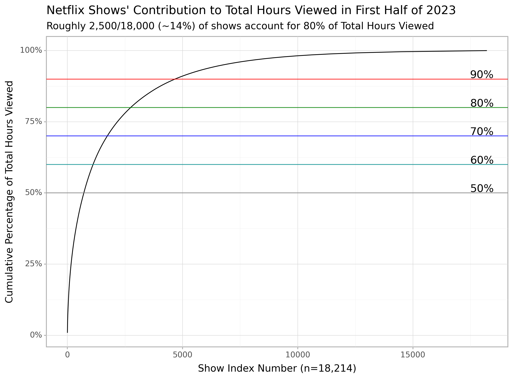
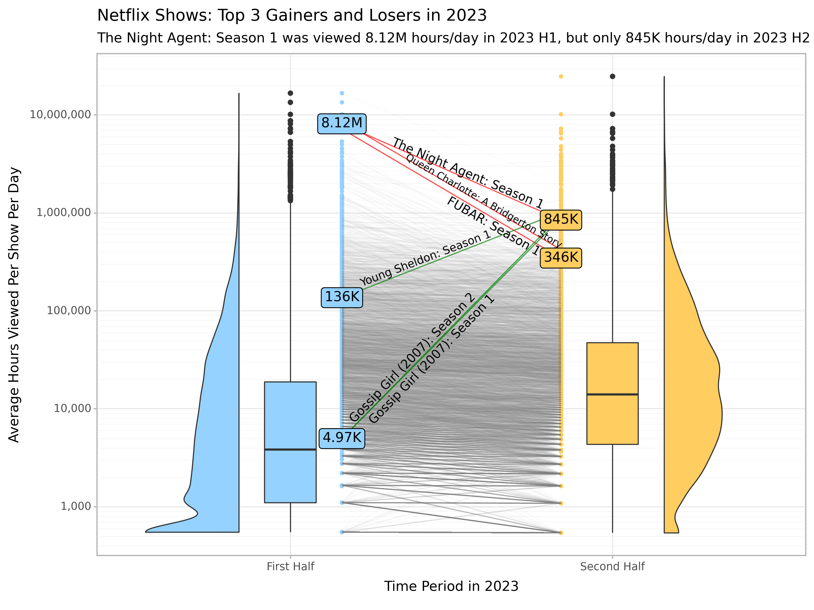

## Netflix Engagement Trends in 2023

*Author*: [Peter Wu](https://www.linkedin.com/in/peter-wu97/)

  

## Introduction and Business Context

In its [2024 Q1 quarterly earnings report](https://s22.q4cdn.com/959853165/files/doc_financials/2024/q1/FINAL-Q1-24-Shareholder-Letter.pdf), [Netflix](https://www.netflix.com/) made the surprising announcement that it would discontinue reporting its quarterly subscriber figures (but still report significant milestones along the way for this metric). Its argument was that they had developed new revenue streams like advertising and new extra member feature (notably by [cracking down on password sharing](https://www.cnn.com/2024/04/18/business/netflix-earnings-first-quarter/index.html#:~:text=Netflix%20will%20stop%20sharing%20quarterly%20subscribers&text=%E2%80%9CWe've%20evolved%2C%20and,of%20members%2C%E2%80%9D%20he%20said.)), and so the subscriber count was not their true north star metric anymore, but rather engagement (i.e. time spent). Thus, in 2023, Netflix started releasing [engagement reports](https://about.netflix.com/en/news/what-we-watched-a-netflix-engagement-report) for the time spent consuming each film in periods of measurement of 6 months. 

In my initial analysis, we discover that when analyzing engagement data from January 2023 to June 2023, **roughly 2,500 of the 18,000 total shows account for 80% of the total hours viewed** during that period of measurement. Additionally, **roughly 5,000 of the 18,000 total shows account for 90% of the total hours viewed** during that period of measurement. The distribution of the total hours viewed per show exhibits a high degree of skewness. Let's try to concretely visualize that better. In our final plot, we want to get a sense for the typical engagement for a show on Netflix and see which ones gained or lost the most engagement in 2023.
 
## Plot Submission

The plot below is my submission for the 2024 Plotnine Contest:

Some simplifying assumptions made:
- For shows with no release date provided, I assume that the release date is at least as far back as the first day of the period. For example, *Breaking Bad: Season 3* has no release date provided, so I assume its release date for the January to June 2023 dataset is **at least as far back** as January 1, 2023. Simply put, a show with no release date will have already been released throughout the entire period of measurement.
- The metric of interest is the total hours viewed per show per day within that measurement period. For example, *The Night Agent: Season 1* was released in the first half of 2023 on 2023-03-23, and so the total days of measurement is the amount of days (inclusive) between 2023-06-30 (end of 2023 first half) and 2023-03-23, or 100 days. Thus, the film's average hours viewed per day in the first half of 2023 is 812,100,000 (total hours viewed in first half of 2023) divided by 100 (days in measurement period), or 8,121,000 hours per day.
- I only include shows with at least **30 measurement days** in the period (first half should have at least 30 days and second half should have at least 30 days). Since *The Night Agent: Season 1* had 100 total days of measurement in the first half, I include that show in my plot.

## Compelling aspects of the plot
- Using `scale_y_log10()` for the y-scale is particularly appealing because the distribution of the average hours per show per day is heavily right skewed. Furthermore, using `geom_label()` complements this well because it will signal to the viewer of the plot by looking at some of the numbers (like 8.12M and 845K) that the scale is not a linear scale, but on the log scale.
- Visualizing where individual points are on the box plot when it transitions between time periods is useful. *The Night Agent: Season 1* decreased in engagement, but is still much higher than most of the films according to the box plot. The density plot helps add additional information to the weight of the points.
- For a fixed number of Netflix subscribers, the amount of runtime that can be logged by Netflix users is finite. If I'm a VP a Netflix, I can look at these trends to see which shows we may want to temporarily discontinue or cut. I can also use this data when thinking about allocating budgets for new films - I can think of paying $100M for a film to buy 500M projected engagement hours in a period of 6 months.

## Comments on the plot and other things I tried
- Not surprisingly, the top losers appear to be several shows that were just released and gradually decreased in engagement after the initial release. For example, *The Night Agent: Season 1* decreases in engagement after its initial release in March 2023. The top gainers appear to be several shows that precede the release of a new Netflix release the following period. For example, *Young Sheldon: Season 1* was the highest gainer when it was announced that [Young Sheldon: Season 6](https://decider.com/2024/05/22/young-sheldon-season-7-netflix-release-date/#:~:text=When%20will%20Season%207%20of,finale%20on%20May%2018%2C%202023.) would be arriving on Feb. 1, 2024.
- It appears that the shows with the highest engagement in 2023 H2 were all released during that half. This makes sense intuitively as Netflix viewers are likely drawn towards new releases (and Netflix probably heavily promotes them on and off the platform).
- See how date since release date correlates with average hours viewed per day. Which shows released very far back are still showing very strong engagement numbers?
- The report for the second half of 2023 included the runtime of each show, which means we can compute **total views**. But since the report for the first half of 2023 does not have it, it will not be as simple to compare the two halves using the runtime time of each show.